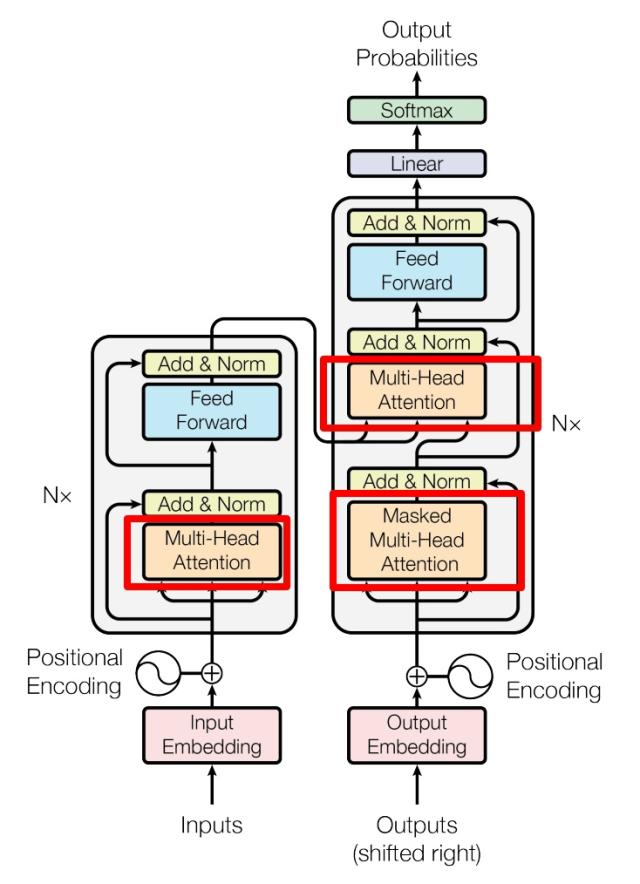

# 整体流程

# 位置编码

## 位置编码演变历程

### 整型标记位置

给第一个token标记1，第二个标记2，以此类推这样做的问题是 👇

1. 模型如果遇见比训练时更长的序列， 泛化能力不好
2. 模型的位置表示可能无界

### [0,1]范围标记位置

0表示第一个位置，1表示最后一个位置，这样做的问题是 👇

大部分序列长度不同时，token间的相对距离不一样了

### 💡 因此，位置表示方式需要满足

1. 能表示token在序列中的绝对位置
2. 能表示token之间的相对距离
3. 不同长度序列中相同相对距离的token对应的位置编码应该相似
4. 位置编码的取值应该有界

## 位置编码

🍎 位置表示公式

$$
PE_{(pos,2i)} = sin(pos/10000^{2i/d_{model}})     \tag{1}
$$

其中：

- pos: 表示token在序列中的位置（从0开始的索引）
- i: 表示维度对的索引（从0到d_model/2-1）
- d_model: 表示模型的隐藏层维度大小

$$
PE_{(pos,2i+1)} = cos(pos/10000^{2i/d_{model}})   \tag{2}
$$

举例说明：

- 如果d_model=512，那么i的取值范围是[0,255]
- **每个token的位置编码都是一个d_model维的向量**
- 偶数维度(2i)使用sin函数，奇数维度(2i+1)使用cos函数
- 10000的指数项使得不同维度有不同的波长，形成多尺度的位置表示

🍊 余弦定理

$$
sin(α+β) = sin(α)cos(β) + cos(α)sin(β)     \tag{3}
$$

$$
cos(α+β) = cos(α)cos(β) - sin(α)sin(β)     \tag{4}
$$

🍌 由公式1，2，3，4，可以推导出：

$$
PE_{(pos+k,2i)} = sin(pos/10000^{2i/d_{model}})cos(k/10000^{2i/d_{model}}) + cos(pos/10000^{2i/d_{model}})sin(k/10000^{2i/d_{model}})
$$

$$
PE_{(pos+k,2i+1)} = cos(pos/10000^{2i/d_{model}})cos(k/10000^{2i/d_{model}}) - sin(pos/10000^{2i/d_{model}})sin(k/10000^{2i/d_{model}})
$$

**由此可以看出，位置编码的点积可以表示相对位置信息，从而可以表示token之间的相对距离。**

# 注意力机制与自注意力机制

## 1. 数据示例

下面的表格展示了 Key 和对应的 Value：

| Key (腰围) | Value (体重) |
|:----------:|:------------:|
| 51         | 40           |
| 56         | 43           |
| 58         | 48           |

## 2. 单值预测问题

- **问题描述：**  
  给定一个人的腰围为 57（query），直观上可能预测体重在 43 到 48 之间。简单的计算思路是：(43 + 48) / 2 = 45.5，进而可以认为腰围为 56 和 58 的样本各占 0.5 的权重（因 57 接近于 56 和 58）。

- **存在问题：**  
  这种方法忽略了所有 Key 和 Value 的信息，没有充分利用可用数据。

## 3. 调整注意力权重

- **目标：**  
  通过引入注意力权重 α(q, kᵢ) 来对所有 Key 进行加权求和，从而提高预测准确性。

- **数学表达：**

$$
f(q) = \alpha(q, k_1)v_1 + \alpha(q, k_2)v_2 + \alpha(q, k_3)v_3 = \sum_{i=1}^{3}\alpha(q, k_i)v_i
$$

- **softmax 处理：**  
  对原始注意力分数应用 softmax，可以将它们转换为归一化的概率分布，既保证了所有 Key 权重之和为 1，又能放大与 query 匹配度高的 Key 的影响，使加权求和输出更能反映各 Key 的重要性。

## 4. 高维向量情况

当处理高维向量时，举例说明如下：

  <table>
    <tr>
      <th>矩阵Q</th>
      <th>矩阵K</th>
      <th>矩阵V</th>
    </tr>
    <tr>
      <td>
        <table>
          <tr>
            <th>col1</th>
            <th>col2</th>
          </tr>
          <tr>
            <td>57</td>
            <td>83</td>
          </tr>
          <tr>
            <td>76</td>
            <td>55</td>
          </tr>
        </table>
      </td>
      <td>
        <table>
          <tr>
            <th>col1</th>
            <th>col2</th>
          </tr>
          <tr>
            <td>51</td>
            <td>70</td>
          </tr>
          <tr>
            <td>58</td>
            <td>88</td>
          </tr>
          <tr>
            <td>56</td>
            <td>82</td>
          </tr>
        </table>
      </td>
      <td>
        <table>
          <tr>
            <th>col1</th>
            <th>col2</th>
          </tr>
          <tr>
            <td>40</td>
            <td>55</td>
          </tr>
          <tr>
            <td>43</td>
            <td>59</td>
          </tr>
          <tr>
            <td>48</td>
            <td>65</td>
          </tr>
        </table>
      </td>
    </tr>
  </table>

- **矩阵表达：**

$$
f(Q) = softmax\left(\frac{QK^T}{\sqrt{d_k}}\right)V
$$

- **为何除以 √dₖ？**
  - 当 dₖ 较大时，QK^T 的值会变得非常大，使得 softmax 函数的输出趋向于 1，从而可能导致梯度消失问题。
  - 除以 √dₖ 能将 QK^T 的值缩放到合理范围，确保 softmax 输出稳定。

## 5. 自注意力机制简介

- **定义：**  
  自注意力机制中，Query (Q)、Key (K) 和 Value (V) 都是从同一输入 X 中生成（通常是字向量加位置编码）。

- **线性变换：**

$$
Q = XW_Q,\quad K = XW_K,\quad V = XW_V
$$

其中，W₍Q₎、W₍K₎ 和 W₍V₎ 是可学习的参数矩阵。

