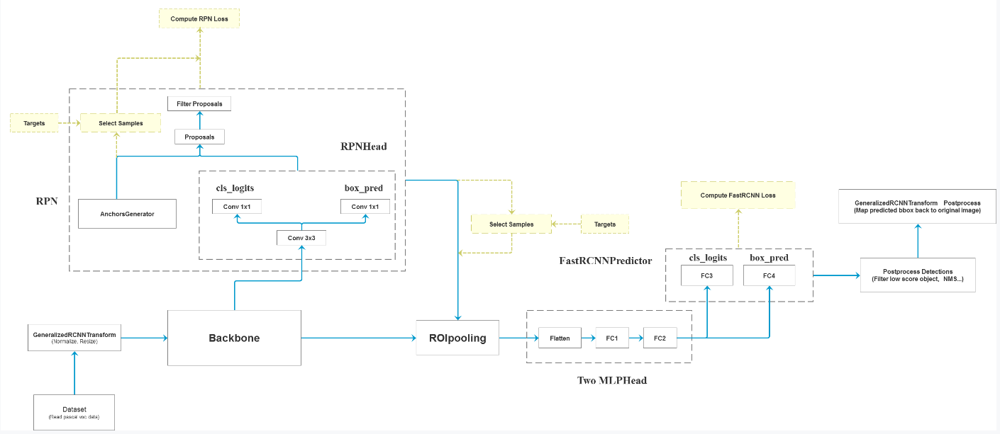
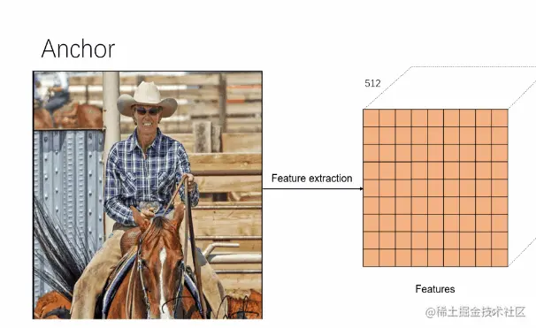

# 目标检测评价指标

 **TP**

> 预测框与gt_box 的iou 大于0.5(阈值)

 **FP**

> 预测框与gt_box 的iou 小与等与0.5(阈值)

 **FN**

> 没有检测到gt的数量

 **precision**

> TP / (TP + FP)
> 模型预测所有目标中，预测正确的比例 （查准率)

 **Recall**

> TP / (TP + FN)
> 所有真实目标中， 预测正确的比例 （查全率）

 **AP**

> P-R曲线下面积

 **mAP**

> 各类别AP的平均值

# RCNN

1. 基于SS算法在每张图片上生成2000个候选框
2. 将候选框区域送到backbone中得到特征(2000x4096)
3. 对特征向量进行SVM分类(20个分类器)
   - 2000x4096  * 4096x20
   - 得到2000x20的概率矩阵
   - 表示特征在每个类别上的概率
4. 采用NMS滤掉一部分候选框
   - 得到该类别最大得分的候选框
   - 与其他候选框计算IOU
   - IOU > 阈值则删除其他的候选框
5. 回归训练
   - 利用backbone特征对候选框进行位置修正
   - 得到每个类别得分最高的候选框 (1x20)

# fast-RCNN

  👉 RCNN的问题是2000个候选框都要送入到特征层中进行特征提取，计算量很大

  🎯  为解决上面的问题

    1. fast-RCNN 将原始图像一边通过CNN 获取特征图， 同时用SS在原始图像上生成2000个候选框(和rcnn一致)
    2. 然后将这些候选框映射到特征图上得到特征矩阵

 ⭐️ 后续操作

    1. 特征矩阵通过ROI-Pooling得到统一的7x7特征图 （不限制输入图像尺寸）
    2. 展平得到预测结果 包括分类器+候选框回归

# faster-RCNN

## 基本流程

  

🎯 **自己总结**

> 1. 图像进行预处理送入到backbone中（包括标准化、resize 以及 batch）
> 2. backbone 网络对预处理后的图像进行特征提取，得到特征图
> 3. 通过一个3✖3卷积，在特征图上生成anchors (如下动图所示)
>    - 滑动窗口在特征图上滑动时， 每次中心位置根据多种比例生成对应anchor数量
>    - 将anchor映射到原图上，得到anchors在原图上的坐标
> 4. 然后基于anchor得到分类和边界框回归偏移量
>    - 分类是判断是前景还是背景
>    - 边界框回归偏移量对anchor的中心点以及宽高进行调整，使其接近真实目标框
> 5. 根据3，4 ， 将调整过的anchors 映射到原图得到proposals， 并通过nms滤掉一部分，保留一定数量的候选框
> 6. 候选区域通过ROI pooling层 得到固定大小的特征 7x7
>    7.通过全连接层展平，预测类别+边界框回归
> 7. 置信度筛选+NMS在此处理，得到最终的结果

## 源码阅读

[参考](https://www.bilibili.com/video/BV1of4y1m7nj/?spm_id_from=333.788.player.switch&vd_source=27496f8ff7e0273476a3325b73c29072&p=5)
