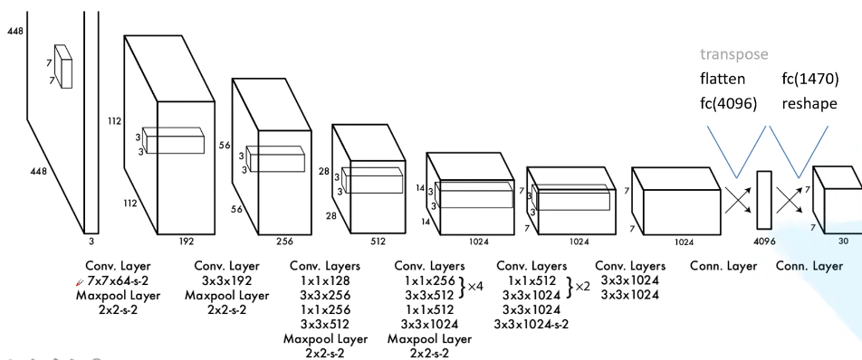

# YoLoV1

YOLOv1的网络结构如下:

网络结构:
- 输入层:          448x448x3的RGB图像
- 卷积层1:         7x7卷积核(stride=2),64个卷积核    -> 224x224x64
- 最大池化层1:     2x2池化核(stride=2)              -> 112x112x64 
- 卷积层2:         3x3卷积核(stride=1),192个卷积核   -> 112x112x192
- 最大池化层2:     2x2池化核(stride=2)              -> 56x56x192
- 卷积层3:         1x1卷积核,128个卷积核            -> 56x56x128
- 卷积层4:         3x3卷积核,256个卷积核            -> 56x56x256
- 卷积层5:         1x1卷积核,256个卷积核            -> 56x56x256
- 卷积层6:         3x3卷积核,512个卷积核            -> 56x56x512
- 最大池化层3:     2x2池化核(stride=2)              -> 28x28x512
- 卷积层7-14:      交替使用1x1(512)和3x3(1024)卷积   -> 28x28x1024
- 最大池化层4:     2x2池化核(stride=2)              -> 14x14x1024
- 卷积层15-20:     交替使用1x1(512)和3x3(1024)卷积   -> 14x14x1024
- 卷积层21-24:     4个3x3卷积层(1024)               -> 7x7x1024
- 全连接层1:       4096个神经元
- 全连接层2(输出层): 7x7x30

网络结构说明:
- 输入为448x448x3的RGB图像
- 包含24个卷积层和2个全连接层
  - 前20个卷积层预训练用于图像分类
  - 后4个卷积层和2个全连接层用于检测
- 输出为7x7x30的张量
  - 7x7表示将图像分成7x7个网格
  - 30 = 2*5 + 20,其中:
    - 每个网格预测2个边界框,每个框包含5个值(x,y,w,h,confidence)
    - 20个类别的条件概率

主要特点:
1. 将目标检测转化为回归问题
2. 端到端训练,速度快
3. 全图特征用于预测,背景误检率低
4. 小目标检测效果较差
5. 密集目标检测效果较差

# YoLoV5

